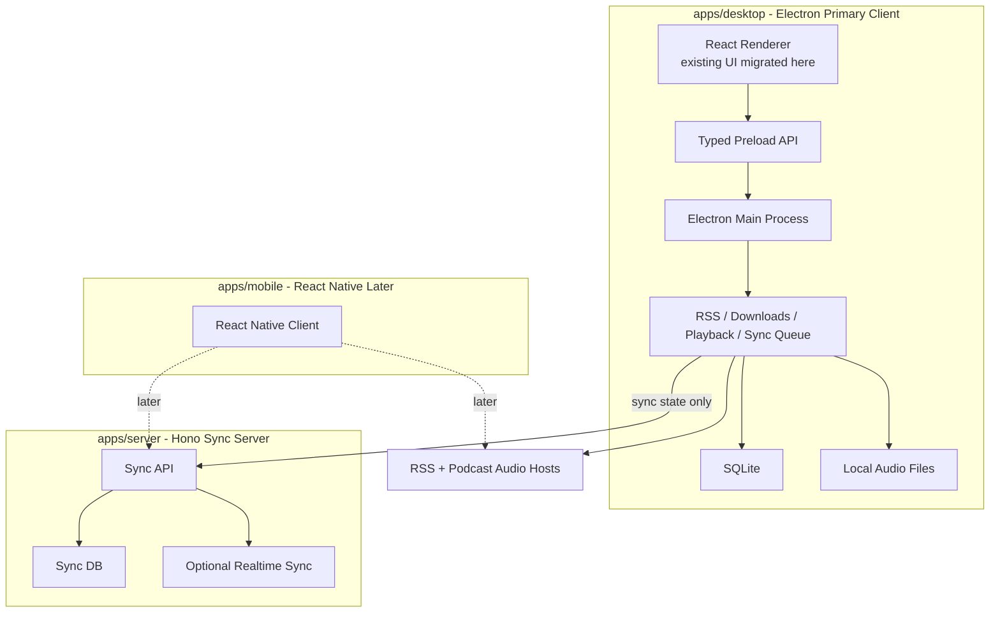
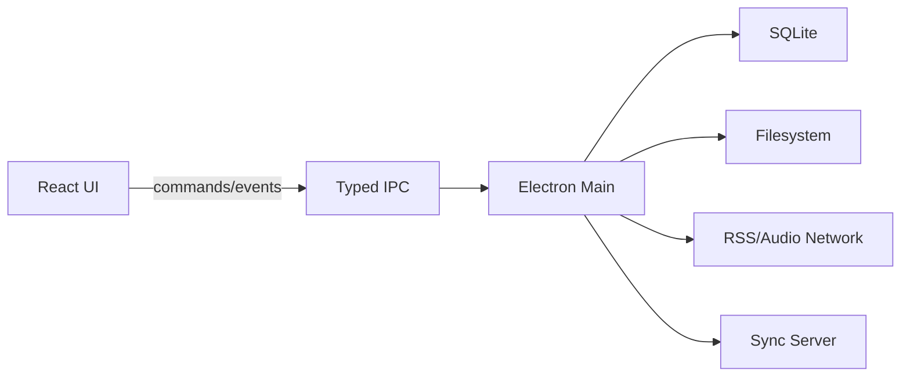
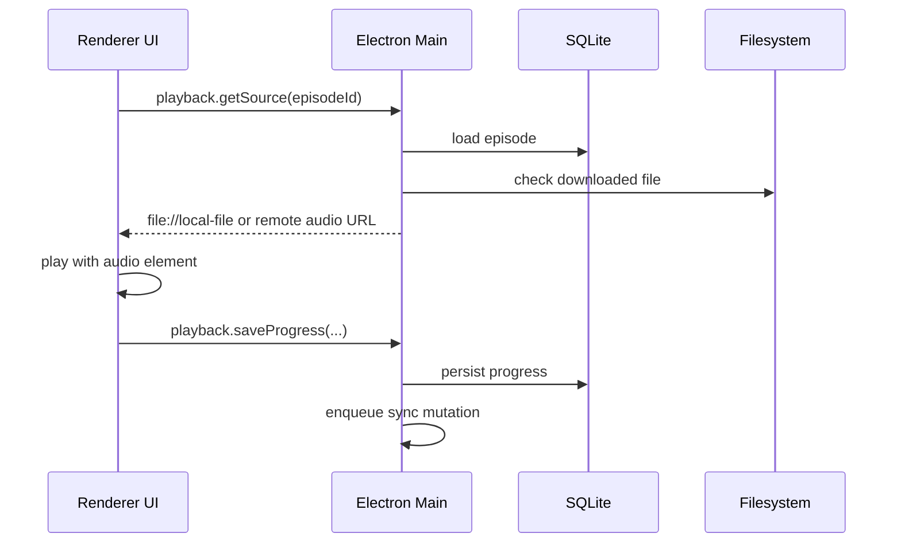
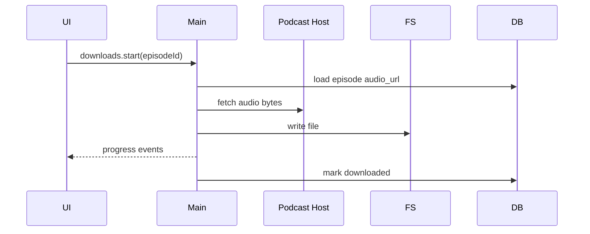
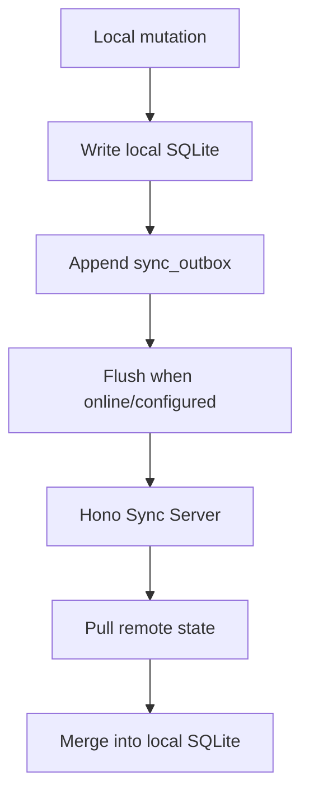

# Electron Client Migration Plan

## Decision

Newcastle should move from a PWA-centered architecture to a client-centered architecture:

- Desktop client: Electron, primary product target.
- Mobile client: React Native, planned but deferred.
- Sync server: Hono, sync-only.
- Product brand: Newcastle, meaning "New podCast player: Listen and Explore."

The server must only synchronize state. Playback, downloads, media cache, RSS/audio fetching for the primary client, file storage, and local database behavior must run on the user's machine.

## Product Rebrand

The product is **Newcastle**.

Meaning:

```text
New podCast player: Listen and Explore
```

The rebrand should apply to the user-facing product and new desktop client direction first:

- application name
- desktop window title
- app metadata
- installer/package display name
- documentation and architecture docs
- UI copy where the product name appears

Internal package names can be renamed later if doing so would create unnecessary migration churn during the Electron transition. Prefer product clarity over broad mechanical renames until the desktop client has a working vertical slice.

## Target Architecture



## Product Roles

Electron desktop is the primary client now.

The PWA is abandoned and should be deleted. Browser-specific storage, service worker media cache,
and local PWA API code should not remain architectural inputs.

React Native mobile should wait until the desktop architecture proves the local-first model.

## Repository Direction

Target layout:

```text
apps/
  desktop/
    src/
      main/
        main.ts
        ipc.ts
        db.ts
        library.ts
        downloads.ts
        playback.ts
        sync.ts
        settings.ts
      preload/
        index.ts
      renderer/
        main.tsx
        app-shell.tsx
        routes/
        components/
      shared/
        ipc.ts
        types.ts

  server/
    src/
      core/
      adapters/
      deployments/

  mobile/
    # deferred

packages/
  contracts/
    src/
      index.ts
```

Do not create many shared packages upfront. Keep `packages/contracts` because sync contracts already belong there. Extract additional packages only when desktop and mobile both truly need them.

## Core Refactor

The current PWA mixes UI, browser runtime behavior, and sync/domain concepts. Electron should split them cleanly:



Renderer must not directly:

- download audio
- write files
- access SQLite
- call Node APIs
- own sync queue persistence

Renderer should only express user intent:

```ts
window.pgcast.library.subscribe(feedUrl)
window.pgcast.episodes.listByPodcast(podcastId)
window.pgcast.downloads.start(episodeId)
window.pgcast.playback.saveProgress(...)
window.pgcast.sync.now()
```

## Local Data Model

Use SQLite in Electron main.

Minimum tables:

```text
podcasts
  id
  feed_url
  title
  author
  description
  image_url
  language
  subscription_date
  last_updated

episodes
  id
  podcast_id
  guid
  title
  description
  content
  audio_url
  image_url
  published_at
  duration
  downloaded_path
  file_size
  downloaded_at

playback_progress
  episode_id
  podcast_id
  current_time
  duration
  is_completed
  last_played_at

preferences
  key
  value

download_tasks
  episode_id
  status
  progress
  error
  started_at
  completed_at

sync_outbox
  id
  kind
  payload
  updated_at
```

Do not preserve Dexie schema compatibility. This is a new client runtime.

## Desktop Runtime Responsibilities

Electron main owns these modules.

`library.ts`

- subscribe to feed
- unsubscribe
- refresh feed
- import/export OPML
- update local podcast and episode records

`downloads.ts`

- download original audio URL directly
- write to local app data directory
- track progress
- cancel, delete, retry
- update SQLite

`playback.ts`

- resolve playable source
- prefer downloaded local file
- fall back to remote audio URL
- save progress
- mark completed

`sync.ts`

- connect to Hono backend
- bootstrap local state
- push queued mutations
- pull remote state
- apply remote state locally
- optionally connect realtime events

`settings.ts`

- preferences
- sync backend credentials
- local storage locations later if needed

## Playback Design

Keep the actual audio element in the renderer unless Electron main playback is needed later.



This avoids overbuilding a native playback engine immediately.

## Download Design



There is no browser CORS issue because networking and file writes happen in Electron main on the local machine.

## Sync Design

The Hono server remains close to the existing design. It should be tightened, not expanded.

Keep endpoints:

```text
GET  /api/meta
GET  /api/sync/state
POST /api/sync/bootstrap
POST /api/sync/subscriptions/upsert
POST /api/sync/subscriptions/delete
POST /api/sync/playback/checkpoint
POST /api/sync/playback/clear-current
PUT  /api/sync/preferences
POST /api/realtime-ticket
GET  /ws/playback
```

Do not add media endpoints.

Desktop sync process:



Local state should always win immediately for UI responsiveness. Server sync is reconciliation, not command authority.

## Migration Strategy

Do not build a universal app abstraction. Make Electron real first.

First vertical slice:

1. Boot Electron app with existing React shell.
2. Store podcasts and episodes in SQLite.
3. Subscribe to one RSS feed from Electron main.
4. Render library and episode list.
5. Play one episode.
6. Save playback progress locally.
7. Sync that progress to Hono.

Second vertical slice:

1. Download episode through Electron main.
2. Save audio file locally.
3. Play local file.
4. Delete download.
5. Ensure sync server is untouched by media.

Then add:

1. Settings.
2. OPML import/export.
3. Refresh feeds.
4. Realtime sync.
5. Packaging.

## Reuse And Replacement

Reuse by moving code into the desktop app before deleting source modules when the code is still
valuable:

- React visual components
- route and page concepts
- podcast list and detail UI
- episode list UI
- settings UI
- sync contract code
- RSS parsing logic if clean enough
- utility functions

Replace:

- Dexie
- service worker media cache
- `/api/download`
- PWA local Hono API
- browser download service
- PWA install/offline assumptions
- browser-only storage assumptions

## Testing Strategy

Keep tests practical.

Must-have tests:

- SQLite repository tests
- RSS subscribe/refresh tests
- download writes file and updates DB
- playback source prefers local file
- sync payload generation
- sync merge behavior
- server route tests proving sync-only API surface

Avoid broad E2E coverage until the first vertical slice works.

## Success Criteria

The new architecture is valid when:

- Desktop can subscribe, list, play, download, and sync without PWA APIs.
- `apps/server` has no media, RSS, or download endpoints.
- Electron main handles media and filesystem locally.
- Renderer accesses local capabilities only through typed preload IPC.
- `apps/pwa` is removed from the workspace.

## Recommendation

Build `apps/desktop` as the new primary client and migrate the existing React UI into it. Do not rewrite pure native from zero. Do not keep bending the PWA around browser limitations. Keep Hono server sync-only.

This preserves UI investment while fixing the architecture at the right layer.
